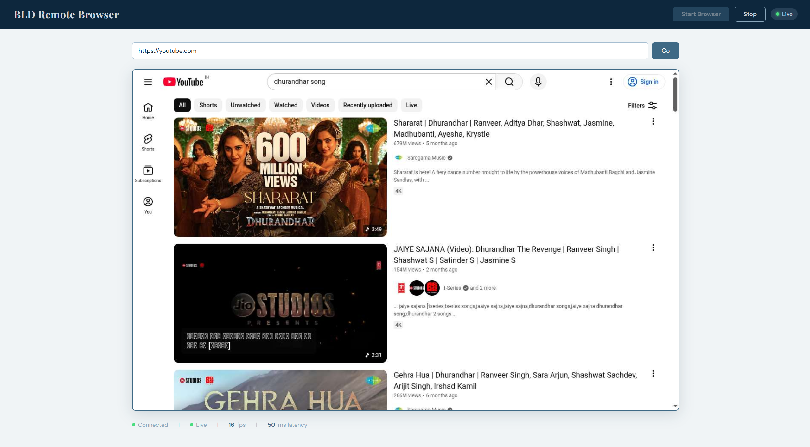
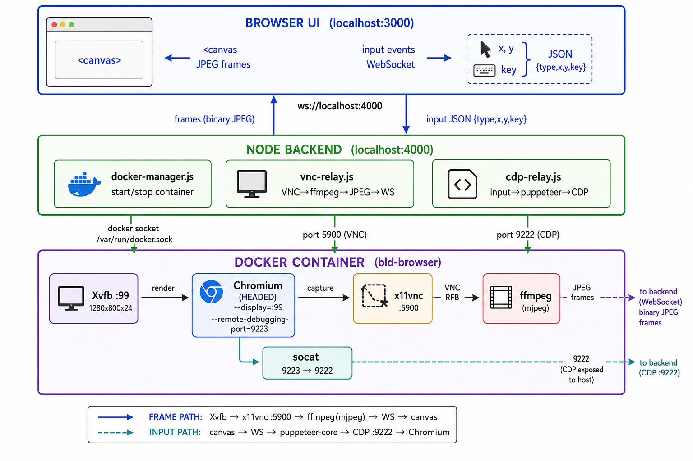

# BLD Remote Browser

A local-only mini TeamViewer for the browser. Spin up a Docker container with Chromium on a virtual display, stream the screen to a React UI over WebSocket, and control it with mouse and keyboard via Chrome DevTools Protocol.

Everything runs on `localhost`. No cloud. No deployment.

## Working Proof



## Prerequisites

- [Docker Desktop](https://www.docker.com/products/docker-desktop/) (running)
- Node.js 18+
- (Optional) [ffmpeg](https://ffmpeg.org/) with VNC support for frame relay. If unavailable, the backend falls back to CDP screenshots.

## Quick Start

### 1. Build the Docker image

```bash
docker build -t bld-browser ./docker
```

### 2. Install dependencies

```bash
npm run install:all
```

### 3. Start the backend

```bash
npm run backend
```

The backend listens on `http://localhost:4000` with WebSocket at `ws://localhost:4000`.

### 4. Start the frontend

In a second terminal:

```bash
npm run frontend
```

Open **http://localhost:3000**, click **Start Browser**, and wait for the live stream.

## How It Works



```
Web UI (localhost:3000)
    │  WebSocket
    ▼
Node.js Backend (localhost:4000)
    │  Docker API + port bindings
    ▼
Docker Container (ephemeral)
    Xvfb :99 → Chromium → x11vnc :5900
    CDP :9222 for input relay
```

- **Frames:** VNC stream via ffmpeg MJPEG pipe (or CDP screenshot fallback)
- **Input:** Mouse, keyboard, and scroll events relayed through puppeteer-core

## Project Structure

```
├── docker/           # Ubuntu + Xvfb + Chromium + x11vnc
├── backend/          # Express + WebSocket + Docker + CDP relay
├── frontend/         # React (Vite) UI
├── .env              # Configuration
└── docker-compose.yml
```

## Configuration

Edit `.env` to change ports, frame rate, or viewport size:

| Variable | Default | Description |
|---|---|---|
| `BACKEND_PORT` | 4000 | Backend HTTP/WS port |
| `VNC_PORT` | 5900 | Host port for x11vnc |
| `CDP_PORT` | 9222 | Host port for Chrome DevTools |
| `DOCKER_IMAGE` | bld-browser | Docker image name |
| `FRAME_RATE` | 15 | Max frames per second |
| `VIEWPORT_W` | 1280 | Browser viewport width |
| `VIEWPORT_H` | 800 | Browser viewport height |

## Troubleshooting

| Issue | Fix |
|---|---|
| Docker image not found | Run `docker build -t bld-browser ./docker` |
| Docker socket permission denied (Linux) | Add your user to the `docker` group |
| CDP port not ready | Wait a few seconds; container boot takes 3–5s |
| No frames streaming | Install ffmpeg, or rely on CDP fallback (automatic) |
| Coordinate mismatch | Canvas normalises clicks to 1280×800 viewport |

## Test the Docker Image Manually

```bash
docker run --rm -p 5900:5900 -p 9222:9222 bld-browser
```

Connect any VNC client to `localhost:5900` to verify Chromium is visible.

---

*Built for BLD SDE Intern Assignment — all running on localhost.*
